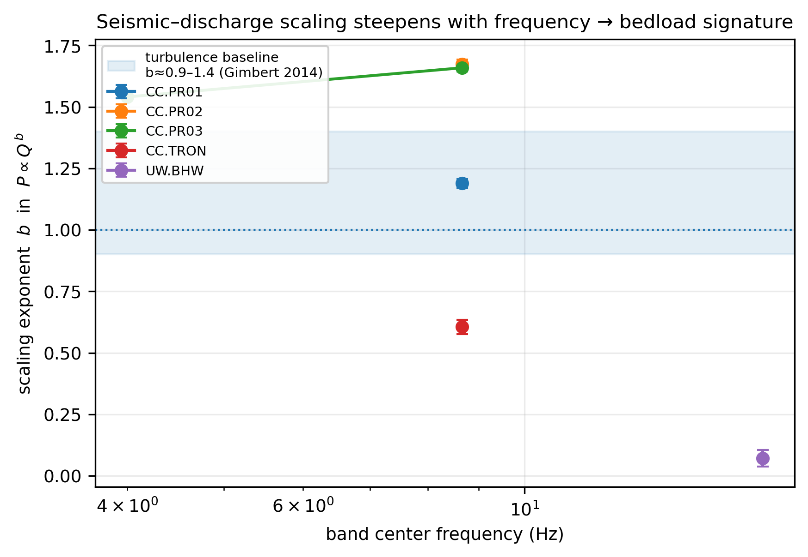
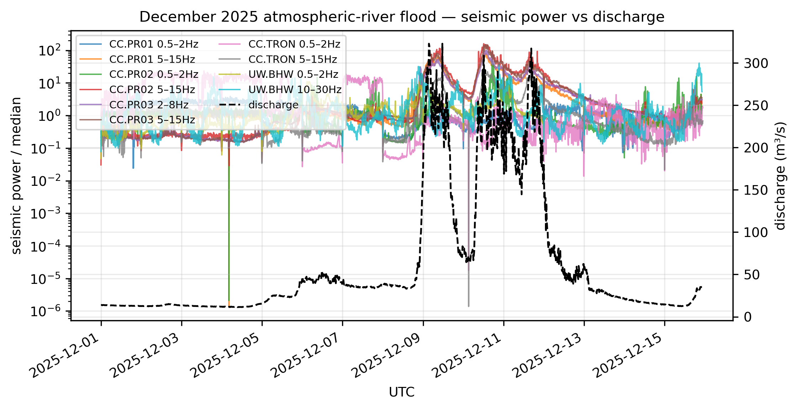

# Introduction

Bedload sediment transport sets the pace of channel aggradation, controls flood
conveyance, and drives sediment hazard in glacier-fed mountain rivers, yet it
resists direct measurement. Passive seismic monitoring offers a continuous,
non-contact alternative [@burtin2008; @tsai2012; @gimbert2014; @cookdietze2022].
Two sources dominate the near-channel high-frequency wavefield: turbulent flow,
whose seismic power scales roughly linearly with discharge
($P_\text{water}\propto H^{7/3}\propto Q^{0.9\text{–}1.4}$; @gimbert2014), and
bedload grain impacts, whose power is threshold-controlled and strongly
nonlinear in discharge but linear in flux and proportional to the cube of grain
size [@tsai2012; @bakker2020].

<!-- 💬 Gap: lead with the COMBINATION — transect scale + Cascades glacial rivers +
named AR event. Do NOT claim the β(f) diagnostic as novel (Bakker 2020). -->

The December 2025 atmospheric-river floods on Mt. Rainier — near-record discharge
on the Carbon River and widespread debris flows — provide a natural experiment in
flood-driven sediment delivery from a glacial source toward Puget Sound.

# Setting and event

The Puyallup River system drains the west flank of Mt. Rainier (Puyallup, Tahoma,
and Carbon Glaciers) ~54 km to Commencement Bay, Puget Sound. We analyze a
longitudinal transect of seismic stations (@fig-map): an upper broadband cluster
in the glacial source reach and, downstream, urban strong-motion accelerometers
toward the coast (the latter treated as exploratory). The river has aggraded up
to 2.3 m (1984–2009) where it exits its confined upper reach [@czuba2012].

{#fig-map width=70%}

# Data and methods

Seismic waveforms (IRIS FDSN) are processed in whole-UTC-day blocks: strict
instrument-response removal to ground velocity, root-sum-square combination of
the Z/N/E components, and Welch power spectral density integrated over each band
in 10-min windows. Earthquakes (USGS, $M\ge3.5$ within 500 km) and impulsive
transients (STA/LTA, clipped within triggered windows only) are removed. Discharge
comes from USGS NWIS; a high-pass-detrended, sign-constrained lag scan aligns the
series. We fit $\log_{10}P = a + b\log_{10}Q$ robustly (ordinary least squares and
Theil–Sen, with bootstrap 95 % confidence intervals) per frequency band, and
quantify event hysteresis with the Lawler index. Full parameters are in
`config/analysis.yaml`; the pipeline and its 2026 corrections are documented in
`REVIEW_2026.md`.

# Results

::: {#tbl-scaling}


Robust seismic–discharge scaling fits per station and band (bootstrap 95 % CI).
$b>\sim1.4$ indicates a bedload contribution; HI is the event Lawler hysteresis
index (+ = clockwise). Regenerated by `workflows/02_make_figures.py`.
:::

The seismic–discharge scaling exponent **steepens with frequency above the
turbulent-flow baseline** at the glacial-source station (@fig-scaling, @fig-scatter),
the signature of a bedload contribution. A lowland control river shows no
high-frequency coupling, ruling out a generic flow artifact.

{#fig-scaling width=75%}

{#fig-scatter width=95%}

{#fig-hyst width=95%}

{#fig-ts width=85%}

# Discussion

<!-- 💬 Defenses to write out:
  - Nativ et al. 2025: stationary-boulder turbulence can raise high-f power.
    Counter with (a) lowland null, (b) event hysteresis, (c) steepening that
    tracks the flood rather than a fixed bed.
  - Roth et al. 2017: roughness-change hysteresis. Tie HI sense to the
    debris-flow supply chronology, not stage.
  - Reconcile our empirical ~1 baseline with Gimbert's ~1.4 prediction.
  - What a transect adds over single-reach arrays (Roth 2014; Schmandt 2017;
    Antoniazza 2023): catchment-length, glacial-source-to-lowland scale. -->

# Conclusions

# Open science {.unnumbered}

All code, configuration, and figure-generation scripts are in this repository.
Seismic data are from IRIS FDSN and discharge from USGS NWIS (public). Figures and
the scaling table regenerate via `pixi run python workflows/02_make_figures.py`.

# References {.unnumbered}
