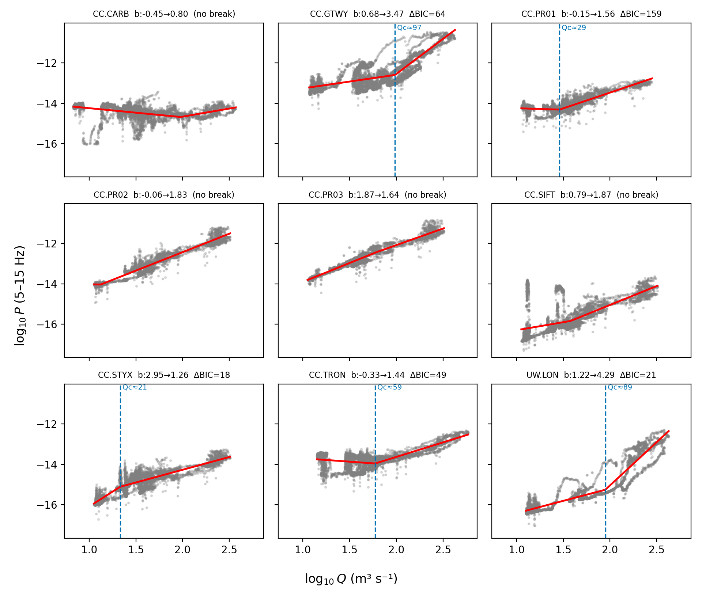

# Introduction

Bedload sediment transport sets the pace of channel aggradation, controls flood
conveyance, and drives sediment hazard in glacier-fed mountain rivers, yet it
resists direct measurement. Passive seismic monitoring of the high-frequency
ground motion radiated by rivers offers a continuous, non-contact alternative
[@burtin2008; @tsai2012; @gimbert2014; @cookdietze2022].

Two sources dominate the near-channel high-frequency wavefield, and — because we
observe discharge $Q$, not the underlying hydraulics — we cast both as scalings in
$Q$. Turbulent flow over the bed radiates seismic power that is, to first order,
**linear in discharge**,

$$
P_{\text{water}} \;\propto\; Q^{\,b_t}, \qquad b_t \approx 0.9\text{–}1.4 ,
$$ {#eq-water}

whereas bedload grain impacts radiate power that is **threshold-gated and
super-linear** in discharge,

$$
P_{\text{bed}} \;\propto\; (Q - Q_c)^{\,b_b}, \qquad b_b > b_t ,
$$ {#eq-bed}

with $Q_c$ an entrainment threshold. A bedload contribution therefore makes the
measured exponent $b$ exceed the turbulence baseline $b_t$ and rise with frequency
[@bakker2020].

*Model assumptions behind @eq-water–@eq-bed.* These discharge forms are reductions
of the physical models, and we list the assumptions they fold in. The turbulence
exponent follows from $P_{\text{water}}\propto H^{7/3}S^{7/3}\propto u_*^{14/3}$
(Gimbert et al. 2014) combined with at-a-station hydraulic geometry
($H\propto Q^{0.3\text{–}0.6}$ at fixed slope $S$), giving $b_t\approx1$. The
bedload form follows from $P_{\text{bed}}\propto q_b\,D^{3}$ with impact flux
$q_b\propto(\tau_*-\tau_{*c})^{3/2}$ (Tsai et al. 2012; @bakker2020), so $b_b$
inherits the excess-Shields-stress nonlinearity and the strong $D^3$ weighting
toward the coarse grain-size tail. We do not measure flow depth $H$, shear
velocity $u_*$, Shields stress $\tau_*$, or grain size $D$; they enter only as the
exponents $b_t,b_b$ and the threshold $Q_c$, which we estimate empirically. Two
further assumptions are implicit and revisited later: that the recorded frequency
band actually samples the bedload source (it is set by station Nyquist; §Methods),
and that seismic attenuation lets a station sense the channel of interest
(§Discussion).

The December 2025 atmospheric-river floods on Mt. Rainier — near-record discharge
on the Carbon River — provide a natural experiment in flood monitoring along a
glacial-river transect. We first establish what the network can robustly measure:
band-limited seismic power that tracks turbulent flow and therefore discharge.
We then ask three questions — (i) does a *bedload* contribution emerge, and is it
even sampled given station bandwidth? (ii) how does the signal organize in space
(source→downstream) and across the successive AR pulses? and (iii) can upstream
seismic anticipate the downstream flood peak? As we show, the resolvable band is
turbulence-dominated and the canonical bedload band is unsampled, so bedload
remains a bounded hypothesis while the turbulent-flow and early-warning results
are robust.

# Data and study area

The Puyallup River system drains the west flank of Mt. Rainier (Puyallup, Tahoma,
and Carbon Glaciers) roughly 54 km to Commencement Bay, Puget Sound. The channel
has aggraded by up to 2.3 m (1984–2009) where it leaves its confined upper reach
[@czuba2012], underscoring an active, supply-rich sediment system.

We use the Cascade Volcano Observatory (network **CC**) stations across the
**western-draining basins of Mt. Rainier** — Puyallup, Carbon, Mowich, Nisqually,
and upper White — paired with USGS discharge gages and NRCS SNOTEL/precipitation
stations (@fig-map). This is a dense (~30-station), multi-basin, multi-sensor
network, not a single transect.

**An upgrading network.** The CC stations are being upgraded from 50 sps to
**500 sps** high-rate (CH) channels: 19 of 31 stations in the study area now list
CH channels (Nyquist 250 Hz) in their metadata (@fig-map, marker color). However,
these high-rate channels came online in **2026**: for the December 2025 event only
the legacy **50-sps (BH)** waveforms are archived and retrievable (CH returns no
data through FDSN at any 2025 date), capping the resolvable band at the **25 Hz
Nyquist** — below the canonical 30–80 Hz bedload band. The highest-rate
near-channel data that *do* exist for the event are the **100-sps (HH)** PNSN/UW
broadband stations (UW.RER 0.44 km, UW.LON 0.21 km), which reach a 30–50 Hz lower
bedload edge. The 500-sps upgrade is thus a *2026 capability*: the same event today
would be recorded into the full bedload band — the basis for the "what-if 2026"
scenario (§Discussion) — and it also flags that **instrument upgrades must be
matched by high-rate data archival** to realize bedload monitoring. The event
peaked at ≈323 m³/s at Puyallup-near-Electron on 2025-12-09.

{#fig-map width=92%}

# The December 2025 atmospheric-river floods

The study event was a **historic compound atmospheric-river sequence**, among the
strongest and longest-lasting on record for the Puget Sound region. Two back-to-back
ARs made landfall ~8–12 December 2025, delivering on the order of 25 cm of rain in
the Cascades (locally more over the multi-week period) and >7 cm in ~10 h at the
Paradise station on Mt. Rainier, on top of a warm, rain-on-snow setup. Washington
Governor Ferguson declared a **statewide emergency** (~10 December); tens of
thousands were under evacuation orders and hundreds of water rescues were
conducted.

The western-draining rivers of Mt. Rainier responded at or near record levels:
the **Carbon River near Fairfax reached its highest stage in 19 years** (a
near-record crest), the **Puyallup produced historic flooding** through Pierce
County (Orting, Puyallup), and the **Nisqually saw major flooding**. Mt. Rainier
National Park closed indefinitely after mudslides and road washouts. In our gage
record the event built **downstream**: peak discharge of ≈306 m³/s at Puyallup
near Electron (RM 41), ≈350 m³/s on the Carbon, ≈416 m³/s on the Nisqually, and
**≈1254 m³/s at Puyallup at Puyallup** near the mouth — the latter ~4× the
headwater peak (@fig-ew).

This combination — a named, well-documented, near-record AR flood over a
glacier-fed volcanic edifice draining toward a densely populated, lahar-hazard
lowland (Orting–Puyallup–Tacoma) — makes the event a rare natural experiment for
testing seismic flood and sediment monitoring, and is the motivation for the
network analysis that follows.

# Methods

Seismic waveforms (IRIS FDSN) are processed in whole-UTC-day blocks. We remove the
instrument response to ground velocity (strictly: a day with missing or failed
response metadata is dropped rather than silently integrated as raw counts),
combine the Z/N/E components as a root-sum-square, and integrate the Welch power
spectral density over each frequency band in 10-minute windows to form a band
power proxy $P(t)$. Earthquakes (USGS catalog, $M\ge 3.5$ within 500 km) and
impulsive transients (STA/LTA detection, clipped within the triggered windows
only) are removed.

Discharge $Q(t)$ comes from USGS NWIS (instantaneous values, m³/s). We align the
seismic and discharge series with a high-pass-detrended, sign-constrained
constant-lag cross-correlation, which avoids the spurious large lags that arise
when the slow storm trend dominates. For each station and band we fit the
power law

$$
\log_{10} P \;=\; a \;+\; b\,\log_{10} Q
$$ {#eq-fit}

robustly (ordinary least squares and Theil–Sen, with bootstrap 95% confidence
intervals on $b$), and quantify event hysteresis with the Lawler index. The
0.5–2 Hz band is excluded from the turbulence baseline because it is dominated by
the oceanic secondary microseism rather than river flow.

**Frequency sampling — an important caveat.** Turbulent flow dominates the
seismic wavefield at ~1–20 Hz and bedload impacts at higher frequencies, with the
bedload band conventionally placed at **30–80 Hz** (Tsai et al. 2012; @bakker2020).
Our upper-transect broadband stations (network CC) sample at **50 sps (Nyquist
25 Hz)**, so they *cannot* reach the canonical bedload band: our 5–15 Hz "bedload"
proxy in fact sits in the turbulence-to-bedload transition and is partly
turbulence-controlled. Accessing the true 30–80 Hz band requires ≥160-sps
instruments; the only such stations on the corridor are the lowland urban
accelerometers (100–200 sps), several of which are traffic-polluted. We therefore
interpret the upper-station exponents as a *transition-band* bedload indicator and
separately analyze the high-rate lowland stations in the 30–80 Hz band (§Results)
to probe genuine bedload frequencies, accepting their anthropogenic-noise penalty.

**Station screening.** Candidate lowland stations were screened for anthropogenic
contamination over a pre-flood week by the weekday/daytime-vs-night cycle of
4–12 Hz power (`workflows/04_traffic_noise.py`). The glacial-source broadband
stations are river-dominated (traffic index ≈1.3–2.6), whereas most lowland urban
accelerometers are traffic-polluted — UW.TEHA most severely (traffic index ≈59,
weekday/weekend ≈21; correlation with discharge $r\approx0$) — and are excluded
(@fig-traffic). This restricts the usable transect to the upper broadband network.

{#fig-traffic width=85%}

Full parameters are in `config/analysis.yaml`; the pipeline and its 2026
corrections are documented in the [review chapter](../REVIEW_2026.md).

# Results

::: {#tbl-scaling}


Robust seismic–discharge scaling fits per station and band (bootstrap 95% CI).
$b\gtrsim 1.4$ indicates a bedload contribution; HI is the event Lawler hysteresis
index (positive = clockwise). Regenerated by `workflows/02_make_figures.py`.
:::

**Frequency-dependent steepening.** At the glacial-source station CC.PR03 the
exponent rises from $b=1.54$ (2–8 Hz, $r=0.94$) to $b=1.66$ (5–15 Hz, $r=0.94$),
above the turbulent-flow baseline (@fig-scaling, @fig-scatter) — the signature of
a bedload contribution superimposed on turbulence.

**Spatial decay.** In the 5–15 Hz bedload band the exponent decays from the
glacial source downstream and away from the channel: $b=1.66$–$1.67$ at the
near-channel Electron stations (CC.PR02, CC.PR03), $b=1.24$ ($r=0.60$) at the
tributary station CC.SIFT (~7.5 km off the mainstem), $b=1.19$ at CC.PR01 (0.7 km
off-channel), and $b=0.61$ ($r=0.55$) at CC.TRON ~20 km downstream and 5.2 km from
the channel. The high-frequency excess over the turbulence baseline is therefore
confined to the near-source reach and falls to (or below) baseline downstream —
an internal contrast indicating the response is source-specific rather than a
generic flow artifact.

{#fig-scaling width=82%}

{#fig-scatter width=95%}

{#fig-hyst width=95%}

{#fig-ts width=92%}

## Where river seismology works — and where it does not

Across all 13 analyzed stations (best flow band, December 2025), **6 yield a usable
river signal** ($r\ge0.7$): the Puyallup source cluster (CC.PR01/PR02/PR03, CC.STYX)
*and both Nisqually stations* (CC.GTWY $r=0.89$, UW.LON $r=0.91$) — so the method
generalizes to a second basin. Two are **marginal** (CC.SIFT, CC.TRON; $r\approx0.5$–0.6),
and **three show no signal**: CC.CARB (Carbon, 1.7 km off-channel, $r\approx-0.2$),
UW.RER (high on the edifice, far from its gage), and the urban UW.UPS. We plot the
no-signal stations alongside the rest (hollow/grey) rather than hide them, and mark
them on the map (@fig-map, hollow triangles) to document *where river seismology was
attempted and did not work* — itself a useful deployment guide. Notably, the
steepest scaling is on the Nisqually (UW.LON $b\approx2.2$), exceeding the Puyallup
source ($b\approx1.66$).

## Transport-onset threshold

Bedload is threshold-gated, so the seismic-power–discharge relation should steepen
above a critical discharge. A continuous broken-stick fit (@fig-thr) finds a
slope-steepening breakpoint at several stations: $Q_c\approx35$ m³/s on the upper
Puyallup and $Q_c\approx70$–90 m³/s on the Nisqually/Carbon (strongest at UW.LON,
$b:1.2\!\to\!4.3$). This matches the slope-dependent critical Shields stress
($\tau^*_c=0.15\,S^{0.25}$; Lamb et al. 2008), which predicts higher thresholds on
steeper, coarser reaches. The breakpoints are *candidate* transport onsets (the
band is turbulence-dominated; PR03/STYX show no upward break), to be tested
out-of-sample on the March-2026 event.

{#fig-thr width=95%}

## The braided-reach problem: a distributed, non-stationary source {#sec-braided}

The single most consequential geomorphic caveat to everything above is hiding in
plain sight: the Puyallup source cluster (CC.PR01/PR02/PR03, within $\sim$1.5 km of
one another) sits on an **aggrading glacial-outwash braidplain**, not the single,
fixed channel that the governing models assume. Both the turbulent-flow model
[@gimbert2014] and the impact model [@tsai2012] idealize the source as a *single
line channel at a known, stationary distance* $r$, with power decaying as
$\sim r^{-1}\exp(-2\pi f r / v_c Q)$. A braided reach violates this in ways that the
fluvial-seismology calibration literature — built almost entirely on single-thread
channels — has rarely had to confront. We argue this is a distinct interpretive
regime that deserves its own treatment.

**Why braiding changes the physics.** (i) The source is *spatially distributed*
across multiple simultaneously active anabranches spread over a valley floor that
can exceed the e-folding attenuation length ($r_e\approx780$ m at band center). The
station therefore senses an attenuation-weighted sum dominated by whichever thread
is momentarily closest, not by the total discharge. (ii) Discharge *partitioning*
among threads is strongly nonlinear in stage: as stage rises, threads widen,
coalesce, and the wetted front jumps laterally — a purely **geometric** way to
manufacture a steepening $P$–$Q$ break that mimics a transport onset. (iii)
Splitting a given $Q$ into $N$ wide, shallow threads lowers per-channel depth $H$,
and because turbulent power scales as $H^{7/3}$, the braided sum is *suppressed*
relative to a confined channel and the exponent flattens. (iv) Braided threads
**avulse and migrate** between and during floods, so the dominant source relocates —
imposing a non-stationary distance $r$ and resetting the calibration constant.

These expectations match the data. Of the three co-located stations, the most
braidplain-central, **CC.PR01 has the flattest exponent ($b=1.19$, at the turbulence
floor), the lowest correlation ($r=0.88$ vs 0.94), and the sharpest broken-stick
break in the whole network** ($b:0.17\!\to\!1.77$ at $Q_c\approx35$ m³/s; @fig-thr).
Read naively, that break is the cleanest "bedload onset" we have. But a
rising-vs-falling-limb diagnostic (@fig-braid) overturns that reading: the per-AR
$P$–$Q$ loops are **reversible (Lawler hysteresis index $|HI|\le0.06$, no clockwise
sense)** and the in-window **peak power does not decline across successive ARs** —
neither the loop direction nor the supply-exhaustion signature expected for
genuine bedload onset [cf. the clockwise sediment hysteresis of @burtin2008;
@roth2016] is present. The break is therefore most consistent with a **geometric
wetted-front onset**: at $Q_c$ a broad, close, active flow front switches on, not
the bed.

What *is* present is a coherent, monotonic **baseline drift across the AR sequence**:
at matched discharge the 5–15 Hz power rises by $\sim$0.2 log units ($\approx$1.6×)
from AR1 to AR3 at all three stations simultaneously (@fig-braid). A whole-cluster
shift at fixed $Q$ is the signature of the active thread **migrating toward the
stations** over the event sequence — i.e. avulsion/lateral reworking of the
braidplain, exactly the instability proglacial braided systems are known for
[@coppin2022]. This is the first-order risk to the seismic virtual-discharge
rating: a calibration learned on December 2025 may not transfer to a later event if
the channel has moved, independent of any change in the flow itself.

This connects directly to the only dense-array study of a braided reach to date.
Using 80 seismometers across a 600 m braided segment of the Séveraisse (French
Alps), @coppin2022 located impulsive sources to *the bend apex of a single active
branch* — direct evidence that the seismic source in a braided reach lives on
specific, migrating anabranches rather than the whole wetted area. The pioneering
braided-river seismic study [@burtin2011, torrent de St Pierre] likewise had to
contend with multiple channels in attributing $\sim$3–9 Hz power to turbulent flow.
The lesson for a *single regional station* like ours is sharper than for a dense
array: we cannot resolve which anabranch radiates, so we necessarily integrate a
non-stationary, attenuation-weighted sum — and must treat braided-reach exponents,
thresholds, and ratings as **reach-geometry-dependent and event-specific** rather
than universal grain-mechanical constants.

{#fig-braid width=98%}

**Satellite test of the avulsion prediction.** The avulsion reading makes a
falsifiable, geometric prediction: if the cross-AR baseline drift is the active
thread migrating *toward* the cluster, then the wetted channel nearest
CC.PR01/PR02/PR03 should have moved closer between the pre-flood (November 2025)
and post-flood (early January 2026) states, and the implied change should be
*largest at the most braidplain-central station*, CC.PR01. We test this directly
with optical and radar imagery (Sentinel-2 L2A and Sentinel-1 RTC, via the
Microsoft Planetary Computer), differencing cloud-masked MNDWI wetted-channel maps
and VV-backscatter water masks between the two epochs within a 500 m corridor of
the NHD mainstem (@fig-braidsat a,b). We then propagate the resulting channel
geometry through the manuscript's own attenuation kernel, summing an
attenuation-weighted "wetted illumination" $W=\sum_i A_i\,r_i^{-1}\exp(-r_i/r_e)$
over the active-channel pixels at each station ($r_e\approx780$ m, §Discussion),
and read the predicted baseline shift as $\Delta\log_{10}P=\log_{10}(W_\text{post}/W_\text{pre})$.

The result corroborates the avulsion interpretation *in sign and in spatial
order, but not yet in absolute magnitude*. The active channel reorganized
markedly across the event; CC.PR01's nearest active thread moved $\approx$50 m
**closer** (264→214 m), and CC.PR01 shows the **largest** predicted geometric
drift of the three stations (median $\Delta\log_{10}P\approx+0.28$, vs $+0.07$ at
the on-channel anchor CC.PR03), the same rank order and the same positive sign as
the observed $+0.2$-log cross-AR drift (@fig-braidsat c). That the flattest-exponent,
lowest-correlation station is also the one the imagery says was most geometrically
reworked is independent support that CC.PR01's anomaly — and the shared baseline
drift — is a moving-source effect, not a bed-mechanical one. The magnitude,
however, is not robust: because turbid braided water sits near MNDWI$\approx$0,
sweeping the water threshold spreads the predicted drift across roughly
$[-0.6,+1.0]$ log units (error bars, @fig-braidsat c), and part of the larger
post-flood wetted area is seasonal winter baseflow rather than avulsion. At the
10 m resolution of Sentinel the test therefore confirms the *direction and
localization* of the channel-migration effect while leaving its calibrated
magnitude — the conversion of seismic baseline drift into a metric channel-migration
distance — for higher-resolution (≈3 m) imagery. The qualitative verdict stands:
on a braided reach the seismic virtual-discharge rating is reach-geometry-dependent
and can drift between events as the channel moves, exactly the caution §sec-braided
raises.

![Satellite test of the braided-source avulsion prediction. (a) Pre-flood (Nov 2025) Sentinel-2 MNDWI with the post-flood (early Jan 2026) active-channel outline (red); yellow triangles are the three co-located stations. (b) Active-channel change within the NHD mainstem corridor (Sentinel-2 optical $\cup$ Sentinel-1 SAR): blue = persistent water, red = newly wet, orange = newly dry. (c) Predicted geometric baseline drift $\Delta\log_{10}P=\log_{10}(W_\text{post}/W_\text{pre})$ per station from the attenuation-weighted wetted illumination $W=\sum A\,r^{-1}e^{-r/r_e}$ ($r_e\approx780$ m); bars are the median over a MNDWI-threshold ensemble and whiskers its range. CC.PR01 (red) shows the largest drift, matching the observed $+0.2$-log cross-AR shift (green dashed) in sign and rank; the threshold spread shows the magnitude is not yet robust at 10 m resolution.](figures/fig19_braid_change.png){#fig-braidsat width=98%}

A time-resolved corollary, limited to the cloud-penetrating Sentinel-1 record
(optical is cloud-blind through the flood — zero clear Sentinel-2 scenes 1–20 Dec),
tracks each off-channel station's wetted illumination *relative to the on-channel
anchor CC.PR03* through the AR sequence (@fig-braidsat-ts). The braidplain-central
CC.PR01 is preferentially illuminated as flow rises, peaking during the AR maximum —
the geometric flow-front response in time — although SAR's under-detection of
shallow braided water at 10 m leaves the inter-epoch trend noisy and the net
permanent migration better measured by the Nov→Jan bracket above. We treat this as
supporting, not primary, evidence.

![*(Supplementary, exploratory.)* Sentinel-1 (SAR) channel-migration series through the December-2025 ARs: each off-channel station's attenuation-weighted wetted illumination relative to the on-channel anchor CC.PR03 (normalised to mid-November), a ratio that cancels per-epoch scene-count and overall-wetness biases. CC.PR01 (braidplain-central) is preferentially illuminated during the flood peak (shaded) — the geometric flow-front response — then relaxes. SAR under-detects shallow braided water at 10 m, so absolute wetted area is not used; only the between-station ratio.](figures/fig20_braid_timeseries.png){#fig-braidsat-ts width=80%}

## Time-dependent bedload across the atmospheric rivers

The compound event delivered a weak pre-AR (06 Dec ≈50 m³/s) followed by three
strong pulses (AR1 peak 09 Dec ≈304 m³/s, AR2 10 Dec ≈278 m³/s, AR3 11 Dec
≈306 m³/s; @fig-bltime). Using the 5–15 Hz power as a bedload proxy normalized to
each station's pre-flood median, the bed barely moves in the pre-AR (1–4×
background), then **bedload peaks in AR2 at every station (≈110–180× background near
the source), ~3× larger than in AR1 or AR3** — even though AR2's discharge peak was
*not* the largest (@fig-blAR). That a later, slightly-smaller pulse mobilizes the
most bedload — after a priming pre-AR and AR1 — is consistent with progressive bed
loosening/de-armoring raising transport efficiency, a cross-pulse supply effect
rather than a purely hydraulic response. A time-resolved fit of the exponent
confirms this: $b(t)$ rises above the turbulent-flow baseline during AR1–AR2 and
relaxes afterward (@fig-bt). The per-AR averages also fall steeply downstream
(source ≈180× → CC.TRON ≈7×), mirroring the scaling-exponent decay.

{#fig-bt width=92%}

{#fig-bltime width=92%}

{#fig-blAR width=88%}

A multidisciplinary animation that ties SNOTEL precipitation, gage discharge, and
per-station bedload strength together (and shows the traffic-contaminated UW.TEHA
*not* lighting up — bedload is localized to river-proximal clean stations) is in
the repository (`paper/figures/bedload_animation.gif`); the single animation
embedded here is the distributed-discharge field (@fig-vq, Discussion).

## Turbulence or bedload? The frequency evidence

Whether the signal above is bedload or turbulent flow hinges on frequency. Median
flood-vs-quiet velocity spectra (@fig-spec) are unambiguous: at the 50-sps source
station the flood lifts power **broadband from ~1 Hz to the 25 Hz Nyquist** — the
turbulent-flow band — with no access to the canonical bedload band (30–80 Hz;
Tsai et al. 2012; @bakker2020). At the only high-rate (200 sps) downstream station
that *can* reach 80 Hz, the flood spectrum is indistinguishable from quiet — 54 km
of attenuation and urban noise leave no river signal. **No station both reaches the
bedload band and senses the river.** Grain physics agrees: a 1 m boulder's contact
corner is ~200–300 Hz, so intrinsic impacts do not radiate into 1–15 Hz; only
attenuation-shifted, non-unique energy could, degenerate with the 5–7 Hz turbulence
peak. We therefore interpret the resolvable signal as turbulent-flow noise and
treat bedload as a frequency-bounded hypothesis (see Limitations).

{#fig-spec width=82%}

The best available probe of the bedload edge is the 100-sps UW broadband stations
(Nyquist 50 Hz): at UW.LON (Nisqually, 0.21 km) the 30–50 Hz power scales with
discharge ($b\approx1.4$), a tentative high-frequency transport signal, whereas
UW.RER (far from its gage) is noise (@fig-edge). A clean 30–80 Hz test awaits the
2026 high-rate (CH) archive. Grain size, moreover, is encoded in *amplitude*
($\propto D^3$), not in the band: even a 2 m boulder's Hertzian contact corner is
~140 Hz, so within ≤50 Hz boulders and cobbles share a flat spectral shape — a low
band is a coarse-transport *amplitude* proxy, not a grain-size discriminator. The
genuinely low-frequency coarse signatures (debris-flow/lahar boulder fronts to
~2 Hz; possible large-wood tremor) are a separate, underexplored target.

{#fig-edge width=95%}

**A coarser, wood-rich source lowers the band (a grain-size– and process-conditional
caveat).** The canonical 30–80 Hz "bedload band" is a convention built on *clean-gravel
saltation* — where discrete Hertzian grain impacts radiate — and, as above, even metre
boulders keep that impact corner above ~140 Hz, so individual-grain impacts cannot by
themselves explain the 5–15 Hz steepening. But glacier-fed Cascade outwash rivers are
not clean-saltation systems. Their coarse-transport regime is dominated by (i) boulders
moving by **rolling and sliding** and grain–grain collision rather than ballistic
saltation, (ii) abundant **large wood** — logs and log jams delivered by the forested
catchment — and (iii) frequent **hyperconcentrated and debris-flow surges** (Tahoma,
Kautz, Nisqually, and the upper Puyallup are among Mount Rainier's most debris-flow-prone
valleys; USGS). All three radiate *lower* frequencies than gravel saltation: debris-flow
and lahar boulder fronts generate energy down to ~2 Hz, and large, low-stiffness wood is
an intrinsically long-contact, low-frequency impactor. The coarse-transport seismic band
in such systems therefore extends **downward**, into the few-Hz–to–tens-of-Hz range that
overlaps our resolvable 1–15 Hz window — so the 50-sps stations may in fact carry genuine
coarse-clast and large-wood signatures, not turbulence alone. This is double-edged: the
same band is spectrally degenerate with turbulence (and with the immobile-boulder
turbulence of @nativ2025), so the coarse-transport contribution remains *bounded*, not
isolated. The lesson is that the detectability cutoff is **grain-size– and
process-conditional**: in coarse, wood-rich proglacial reaches like the braided Puyallup
source, part of the coarse-transport signal lives *below* 25 Hz and is, in principle,
sampled — one more reason this reach is a distinct interpretive regime rather than a clean
line-channel bedload source (§sec-braided).

## Local sensing and downstream early warning

The seismic signal senses *local* hydraulics, which explains an otherwise puzzling
contrast across the compound event: the **upstream gage and seismic stay flat**
across successive ARs (Electron 304→278→306 m³/s; CC.PR03 power peaking in AR2),
while the **basin-integrating downstream gage rises monotonically** (Puyallup
1014→1150→1254 m³/s). The small, steep glacial headwater received similar forcing
each pulse, and the near-channel station only senses its own ~km reach; the
downstream peak instead grows through cumulative basin-scale processes — soil
saturation, a rising freezing level feeding the large White River sub-basin, and
superposition of lagged tributary waves. The upstream seismic thus follows local,
not integrated, discharge — independent support for the turbulent-flow interpretation.

Because the upstream signal precedes the downstream peak, it carries early-warning
value: the upstream seismic power leads the downstream (Puyallup) stage peak by
~36 h, and the headwater gage leads it by longer (@fig-ew). For an undammed,
gage-sparse, lahar-hazard corridor (Orting, Puyallup), a continuous upstream
seismic proxy could extend warning lead time; predicting the downstream peak
*amplitude* (here 4× the headwater) would require a trained, multi-event model
(see Limitations and the development log).

{#fig-ew width=88%}

# Discussion

The robust result is a **transect of turbulent-flow seismic power that tracks
discharge** through a compound AR flood, with exponents $b\approx1$–1.7 in the
resolvable 1–15 Hz band and a clear AR2 maximum and downstream decay. The
super-linear, frequency-rising part of $b$ is *consistent with* an added,
threshold-controlled bedload term (@eq-bed) weighted toward the coarse grain-size
tail — but, as the spectra show (@fig-spec), the canonical bedload band is
unsampled, so we cannot separate that contribution from turbulence within
1–15 Hz. We therefore present bedload as a bounded hypothesis: an upper limit set
by how much of the steepening could be bedload rather than a measured flux. The
downstream decay similarly conflates genuine along-stream change with the
propagation control on what each station can sense (next).

**Attenuation and seismic reach.** Power decays as $e^{-2\pi f r/(v_cQ)}$ with
e-folding distance $r_e=v_cQ/(2\pi f)$. Rather than the fluvial default $Q\approx20$
(Tsai et al. 2012), we adopt a PNW/Rainier-edifice value $Q(f)=Q_0 f^{\eta}$,
$Q_0\approx25$, $\eta\approx0.5$ (from Cascade coda-/Lg-Q and Mt. St. Helens
edifice studies; @gimbert2014 and refs in the literature chapter), giving
$Q\approx74$ at the 5–15 Hz band center — so $r_e\approx780$ m here (vs ~210 m for
$Q=20$) but still only tens of metres at 50 Hz (@fig-atten a). Bedload is thus
recoverable only within ≲1 km of the channel, and CC.TRON (5.2 km) lies well
beyond reach. A first-order test on the same-source PR cluster (PR03/PR01/PR02 at
0.19/0.71/1.9 km) finds the 5–15 Hz power *nearly distance-independent over
0.2–2 km* — weaker decay than even the PNW prediction (@fig-atten b) — implying the
band retains less-attenuated lower-frequency (turbulence) energy, and that site
response and crude channel distances preclude a data-driven $Q$ from this small
array. We therefore restrict bedload claims to near-channel stations and treat
farther stations as upper-distance bounds rather than attenuation-corrected flux;
a clean correction would require active-source Green's-function calibration
[@bakker2020; @lagarde2021] or amplitude-decay source location across a denser
array (`eseis`; @dietze2018).

{#fig-atten width=98%}

Three alternative explanations must be addressed. First, @nativ2025 show that
stationary boulders can raise high-frequency seismic power through turbulence
rather than transport; we argue against a static-bed origin here because the
high-frequency response tracks the flood hydrograph in time (@fig-ts) and is
confined to the near-source reach (decaying downstream), rather than being a
fixed spectral feature.
Second, @roth2017 caution that channel-roughness change competes with bedload as
a cause of seismic–discharge hysteresis; accordingly we treat the (small) event
hysteresis as suggestive rather than diagnostic and tie interpretation to the
frequency-dependence of $b$, not to hysteresis alone. Third, the turbulence
baseline itself is uncertain: our empirically clean turbulence band sits near
$b\approx1.5$, between the linear expectation and the @gimbert2014 prediction of
$b\approx1.4$, so we report the *excess* of the bedload band over the
station's own lower band rather than over an assumed absolute baseline.

Relative to prior single-reach or watershed bedload arrays [@schmandt2017;
@roth2014; @antoniazza2023], our contribution is not a new bedload measurement but
a **transect-scale demonstration of seismic discharge sensing and flood-wave
tracking on a Cascades glacial network**, plus an explicit **detectability map**
for when bedload seismology is feasible there. "Local" sensing — often treated as
a limitation — is here the asset: a station is a virtual gage for its reach, so an
array becomes distributed, gap-tolerant hydrologic monitoring of an ungaged,
hazard-prone basin.

## Seismic virtual discharge

Each river-proximal station can be calibrated as a rating $\log_{10}P=a+b\log_{10}Q$
and inverted to a **seismic virtual discharge** $Q_{\text{seis}}=10^{(\log_{10}P-a)/b}$.
At clean near-channel stations this tracks the co-located gage well (CC.PR03/PR02
$r=0.94$, Nash–Sutcliffe of $\log Q$ = 0.88/0.86; CC.PR01 0.70; CC.STYX 0.60),
while off-channel/distant stations (CC.SIFT, CC.TRON) are poor — consistent with
the turbulence/attenuation picture. The fitted exponents cluster at $b\approx1.4$–1.7,
near the Gimbert (2014) turbulent-flow prediction, and are roughly steady in time,
so the rating is stable rather than carrying additional time-varying information.
The braidplain station CC.PR01 is the weakest of the source cluster ($r=0.88$, NSE
0.70) and shows the cross-event baseline drift documented in @sec-braided — a
caution that virtual-discharge ratings on braided reaches may need re-calibration
after channel-reworking events rather than transferring unchanged.
Combining the gages with these virtual gages yields a **space–time discharge field**
across the western Rainier drainages (animation, HTML edition), i.e. a distributed
streamflow nowcast from a seismic network.

{#fig-vqval width=95%}

::: {.content-visible when-format="html"}
{#fig-vq width=70%}
:::

## From discharge to stage: the rating curve

Flood and inundation hazard is governed by **stage** (gage height $h$), whereas the
seismic proxy estimates **discharge** $Q$. USGS gages bridge the two with a
site-specific **stage–discharge rating**, $Q = C\,(h-h_0)^{\beta}$, where $h_0$ is
the stage of zero flow and $\beta$ the rating exponent; stage is measured
continuously and converted to discharge via this curve, calibrated by periodic
direct measurements. Fitting the December-2025 stage and discharge at the corridor
gages (@fig-rating) gives $\beta\approx1.6$ near the mouth (Puyallup at Puyallup),
$\beta\approx2$ on the Nisqually, and a much steeper $\beta\approx5$ in the
confined upper Puyallup (Electron) — coarser, narrower channels are more stage-sensitive.
The practical consequence is that a **seismic virtual discharge can be mapped to a
stage nowcast** through the local rating ($h = h_0 + (Q_{\text{seis}}/C)^{1/\beta}$),
turning the upstream early-warning lead (≈36 h) into a forecast of the
flood-relevant variable downstream — without a co-located stage sensor.

{#fig-rating width=70%}

## New capabilities and a 2026 "what-if"

The network that recorded this event is mid-upgrade from 50 to 500 sps (@fig-map),
which reframes what is observable. **Had the identical AR sequence struck in 2026**,
with the 500-sps CH channels live at the near-channel source stations (CC.PR03,
SIFT, STYX, CARB), we could (i) compute the **30–80 Hz bedload band directly** and
test for a *measured* (not merely bounded) bedload signal at the glacial source;
(ii) run the **virtual-discharge field in real time** as a distributed nowcast that
fills the long ungaged reaches between USGS gages; and (iii) operate the
**~36 h upstream-to-downstream lead** as an early-warning product for the
Orting–Puyallup lahar corridor, fused with SNOTEL precipitation and OPERA SAR
flood maps. The same compound event would thus move from a turbulence-and-discharge
study to an integrated, multi-sensor flood-and-sediment observation — the central
forward-looking capability this work demonstrates and recommends.

# Limitations

- **Canonical bedload band unsampled; coarse/wood transport partly is (a grain-size–
  conditional limit).** For December 2025 only the 50-sps (BH) CC waveforms are archived
  (25 Hz Nyquist), so the canonical *clean-gravel* bedload band (30–80 Hz) is absent and
  the 1–15 Hz signal is turbulence-dominated — fine-gravel bedload here is an upper bound,
  not a measurement (@fig-spec). The qualifier is that this cutoff is grain-size– and
  process-conditional: coarse boulder rolling/sliding, large wood, and debris-flow surges
  radiate below 25 Hz (to ~2 Hz), so part of the *coarse*-transport signal is in principle
  sampled — but it is spectrally degenerate with turbulence and cannot be isolated here
  (§Results, frequency evidence). The 500-sps (CH) upgrade came online in 2026 and its
  high-rate data are not yet retrievable through FDSN; obtaining them from CVO/PNSN is the
  route to a direct 30–80 Hz test. For the 2025 event the best available probe is the
  100-sps UW broadband stations (RER, LON) at the 30–50 Hz lower bedload edge.
- **No absolute flux inversion.** We report a band-power proxy and scaling
  exponents, not calibrated bedload flux. Absolute inversion requires
  grain-size and impact assumptions [@tsai2012; @bakker2020] not constrained here.
- **Distance–transport confound.** The downstream decay of $b$ conflates genuine
  along-stream change in transport with frequency-dependent attenuation
  (CC.TRON is 5.2 km off-channel). Disentangling them needs near-channel stations
  downstream, which the current network lacks.
- **Downstream coverage is urban accelerometers.** The lowland-to-Puget-Sound
  reach has only strong-motion stations in noisy settings; those results are
  exploratory, so the "mountain-to-sea" claim is presently anchored in the upper
  ~20 km.
- **Single event, modest hysteresis.** One flood; the event hysteresis is small
  after cleaning, so supply-direction inferences are tentative pending more events.
- **Microseism contamination** of the lowest band (0.5–2 Hz) precludes its use as
  a turbulence reference.

# Conclusions

Near-channel seismic stations along Mt. Rainier's glacial rivers provide a
continuous, distributed proxy for **turbulent flow, and hence discharge**, through
the December 2025 atmospheric-river floods — a capability that does not depend on
resolving bedload. Three contributions follow. (1) *Distributed discharge sensing:*
turbulent-flow power tracks discharge at every station, turning a seismic network
into virtual gages along an otherwise sparsely-gaged glacial network. (2) *Flood
propagation and early warning:* because each station senses its local reach,
the array resolves the flood peak moving downstream and shows upstream seismic
leading the downstream stage peak by ~36 h — directly relevant to the Orting–
Puyallup lahar/flood corridor. (3) *A quantitative detectability limit for bedload
seismology:* the spectra and attenuation analysis show that, with 50-sps source
stations (25 Hz Nyquist) and few-hundred-metre seismic reach at high frequency,
the canonical 30–80 Hz bedload band is unsampled — so any bedload contribution is
an upper bound, and we specify the instrumentation (near-channel, ≥160 sps) needed
to measure it. Extending the existing multi-station network across the drainage
would turn each of these into a calibrated, basin-wide capability.

# Data and software availability {.unnumbered}

Seismic data are from IRIS FDSN (networks CC, UW); discharge and stage from USGS
NWIS; precipitation/snow from NRCS SNOTEL; flood extent from OPERA DSWx-S1. All
analysis code, configuration, and figure-generation scripts are in the project
repository and run inside a `pixi` environment (Quarto included). The complete
pipeline is a numbered sequence of standalone scripts under `workflows/`, each
writing a figure and/or a `config/*.json` it consumes downstream:

| Step | Script | Produces |
|---|---|---|
| discovery | `00_discover_stations.py` | station↔gage transect (river-km) |
| proxy + fit | `scripts/run_river_rumble_batch.py` | per-station `results/*_timeseries.csv`, fits |
| core figs | `02_make_figures.py` | @fig-scaling, @fig-scatter, @fig-hyst, @fig-ts + scaling table |
| map | `03_make_map.py` | @fig-map (PyGMT DEM + gages + SNOTEL + OPERA + status) |
| controls | `04_traffic_noise.py` | @fig-traffic |
| bedload time | `05_bedload_time.py`, `07_fetch_aux_data.py`, `08_b_of_time.py` | @fig-bltime, @fig-blAR, @fig-bt |
| GIFs | `06_bedload_gif.py`, `13_virtual_q_gif.py` | `bedload_animation.gif`, @fig-vq |
| attenuation | `09_attenuation.py` | @fig-atten (PNW Q) |
| early warning | `10_early_warning.py` | @fig-ew |
| frequency | `11_spectra.py`, `14_bedload_ch.py` | @fig-spec, @fig-edge |
| virtual Q | `12_virtual_q.py` | @fig-vqval + ratings |
| threshold | `15_threshold.py` | @fig-thr ($Q_c$) |
| classification | `16_classify_stations.py` | `station_status.json` (drives hollow markers) |
| rating | `17_rating.py` | @fig-rating (stage–discharge) |
| braided source | `18_braided_hysteresis.py` | @fig-braid (geometric-vs-transport diagnostic) |
| braid satellite | `19_braid_optical_change.py` | @fig-braidsat (Sentinel-2/-1 channel change + geometric drift) |

Run order and parameters are documented in `workflows/README.md`; the single source
of analysis parameters is `config/analysis.yaml`. The book (manuscript, this roadmap,
reviews, and figures) is rendered with `pixi run make paper` and auto-deploys to
GitHub Pages on push.
