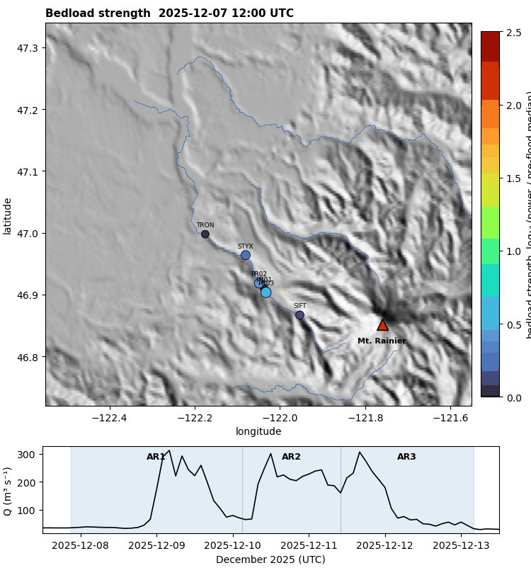

# Introduction

Bedload sediment transport sets the pace of channel aggradation, controls flood
conveyance, and drives sediment hazard in glacier-fed mountain rivers, yet it
resists direct measurement. Passive seismic monitoring of the high-frequency
ground motion radiated by rivers offers a continuous, non-contact alternative
[@burtin2008; @tsai2012; @gimbert2014; @cookdietze2022].

Two sources dominate the near-channel high-frequency wavefield. Turbulent flow
exerting fluctuating tractions on the bed radiates seismic energy whose power
scales with flow depth and slope,

$$
P_{\text{water}} \;\propto\; H^{7/3}\, S^{7/3} \;\propto\; u_*^{14/3},
$$ {#eq-water}

so that, through at-a-station hydraulic geometry ($H \propto Q^{0.3}$ to
$Q^{0.6}$), the seismic power is roughly linear in discharge, $P_{\text{water}}
\propto Q^{b}$ with $b\approx 0.9$ to $1.4$ [@gimbert2014]. Bedload grain impacts,
by contrast, radiate power that is *threshold-controlled* and strongly nonlinear
in discharge but linear in sediment flux and proportional to the cube of grain
diameter,

$$
P_{\text{bed}} \;\propto\; q_b\, D^{3}, \qquad q_b \;\propto\; (\tau_* - \tau_{*c})^{3/2},
$$ {#eq-bed}

where $\tau_*$ is the Shields stress and $\tau_{*c}$ its critical value
[@tsai2012; @bakker2020]. Because flux is super-linear and threshold-gated, a
bedload contribution makes the seismic–discharge exponent $b$ exceed the
turbulence baseline and rise with frequency [@bakker2020].

The December 2025 atmospheric-river floods on Mt. Rainier — near-record discharge
on the Carbon River and widespread debris flows — provide a natural experiment in
flood-driven sediment delivery from a glacial source toward Puget Sound. We apply
the frequency-dependent scaling diagnostic across a longitudinal station transect
to ask *where* and *how strongly* a bedload signal appears, from the glacial
source toward the lowland coast.

# Data and study area

The Puyallup River system drains the west flank of Mt. Rainier (Puyallup, Tahoma,
and Carbon Glaciers) roughly 54 km to Commencement Bay, Puget Sound. The channel
has aggraded by up to 2.3 m (1984–2009) where it leaves its confined upper reach
[@czuba2012], underscoring an active, supply-rich sediment system.

We use a longitudinal transect of seismic stations (@fig-map). Broadband stations
suitable for ambient river-noise analysis (network CC) cluster in the glacial
source reach near Electron (CC.PR01–PR03) and extend ~20 km downstream (CC.TRON);
the lowland corridor toward Puget Sound is covered only by urban strong-motion
accelerometers, treated here as exploratory. Each seismic station is paired with
the nearest co-located USGS discharge gage (e.g. Puyallup River near Electron,
12092000). The event peaked at ≈323 m³/s at Puyallup-near-Electron on 2025-12-09.

{#fig-map width=78%}

# Methods

Seismic waveforms (IRIS FDSN) are processed in whole-UTC-day blocks. We remove the
instrument response to ground velocity (strictly: a day with missing or failed
response metadata is dropped rather than silently integrated as raw counts),
combine the Z/N/E components as a root-sum-square, and integrate the Welch power
spectral density over each frequency band in 10-minute windows to form a band
power proxy $P(t)$. Earthquakes (USGS catalog, $M\ge 3.5$ within 500 km) and
impulsive transients (STA/LTA detection, clipped within the triggered windows
only) are removed.

Discharge $Q(t)$ comes from USGS NWIS (instantaneous values, m³/s). We align the
seismic and discharge series with a high-pass-detrended, sign-constrained
constant-lag cross-correlation, which avoids the spurious large lags that arise
when the slow storm trend dominates. For each station and band we fit the
power law

$$
\log_{10} P \;=\; a \;+\; b\,\log_{10} Q
$$ {#eq-fit}

robustly (ordinary least squares and Theil–Sen, with bootstrap 95% confidence
intervals on $b$), and quantify event hysteresis with the Lawler index. The
0.5–2 Hz band is excluded from the turbulence baseline because it is dominated by
the oceanic secondary microseism rather than river flow.

**Station screening.** Candidate lowland stations were screened for anthropogenic
contamination over a pre-flood week by the weekday/daytime-vs-night cycle of
4–12 Hz power (`workflows/04_traffic_noise.py`). The glacial-source broadband
stations are river-dominated (traffic index ≈1.3–2.6), whereas most lowland urban
accelerometers are traffic-polluted — UW.TEHA most severely (traffic index ≈59,
weekday/weekend ≈21; correlation with discharge $r\approx0$) — and are excluded
(@fig-traffic). This restricts the usable transect to the upper broadband network.

{#fig-traffic width=85%}

Full parameters are in `config/analysis.yaml`; the pipeline and its 2026
corrections are documented in the [review chapter](../REVIEW_2026.md).

# Results

::: {#tbl-scaling}


Robust seismic–discharge scaling fits per station and band (bootstrap 95% CI).
$b\gtrsim 1.4$ indicates a bedload contribution; HI is the event Lawler hysteresis
index (positive = clockwise). Regenerated by `workflows/02_make_figures.py`.
:::

**Frequency-dependent steepening.** At the glacial-source station CC.PR03 the
exponent rises from $b=1.54$ (2–8 Hz, $r=0.94$) to $b=1.66$ (5–15 Hz, $r=0.94$),
above the turbulent-flow baseline (@fig-scaling, @fig-scatter) — the signature of
a bedload contribution superimposed on turbulence.

**Spatial decay.** In the 5–15 Hz bedload band the exponent decays from the
glacial source downstream and away from the channel: $b=1.66$–$1.67$ at the
near-channel Electron stations (CC.PR02, CC.PR03), $b=1.24$ ($r=0.60$) at the
tributary station CC.SIFT (~7.5 km off the mainstem), $b=1.19$ at CC.PR01 (0.7 km
off-channel), and $b=0.61$ ($r=0.55$) at CC.TRON ~20 km downstream and 5.2 km from
the channel. The high-frequency excess over the turbulence baseline is therefore
confined to the near-source reach and falls to (or below) baseline downstream —
an internal contrast indicating the response is source-specific rather than a
generic flow artifact.

{#fig-scaling width=82%}

{#fig-scatter width=95%}

{#fig-hyst width=95%}

{#fig-ts width=92%}

## Time-dependent bedload across the three atmospheric rivers

The compound event delivered three discharge pulses (AR1 peak 09 Dec ≈304 m³/s,
AR2 10 Dec ≈278 m³/s, AR3 11 Dec ≈306 m³/s; @fig-bltime). Using the 5–15 Hz power
as a bedload proxy normalized to each station's pre-flood median, **bedload peaks
in AR2 at every station (≈110–180× background near the source), ~3× larger than in
AR1 or AR3** — even though AR2's discharge peak was *not* the largest (@fig-blAR).
That a later, slightly-smaller pulse mobilizes the most bedload is consistent with
the bed being loosened/de-armored by AR1, raising transport efficiency in AR2 — a
cross-pulse supply effect rather than a purely hydraulic response. The per-AR
averages also fall steeply downstream (source ≈180× → CC.TRON ≈7×), mirroring the
scaling-exponent decay.

{#fig-bltime width=92%}

{#fig-blAR width=88%}

An animated map of per-station bedload strength through the three ARs is available
in the HTML edition (`paper/figures/bedload_animation.gif`):

::: {.content-visible when-format="html"}
{#fig-blgif width=70%}
:::

# Discussion

The frequency-dependent steepening at the glacial source is consistent with a
threshold-controlled bedload contribution: per @eq-bed the bedload term is
super-linear in discharge and weighted toward the coarse grain-size tail, so it
preferentially inflates the higher-frequency exponent during the flood. The
downstream decay of $b$ in the bedload band is physically expected — high
frequencies are strongly attenuated with distance, and CC.TRON sits 5.2 km from
the channel — so the transect maps both genuine along-stream change in transport
*and* the propagation control on what each station can sense.

Three alternative explanations must be addressed. First, @nativ2025 show that
stationary boulders can raise high-frequency seismic power through turbulence
rather than transport; we argue against a static-bed origin here because the
high-frequency response tracks the flood hydrograph in time (@fig-ts) and is
confined to the near-source reach (decaying downstream), rather than being a
fixed spectral feature.
Second, @roth2017 caution that channel-roughness change competes with bedload as
a cause of seismic–discharge hysteresis; accordingly we treat the (small) event
hysteresis as suggestive rather than diagnostic and tie interpretation to the
frequency-dependence of $b$, not to hysteresis alone. Third, the turbulence
baseline itself is uncertain: our empirically clean turbulence band sits near
$b\approx1.5$, between the linear expectation and the @gimbert2014 prediction of
$b\approx1.4$, so we report the *excess* of the bedload band over the
station's own lower band rather than over an assumed absolute baseline.

Relative to prior seismic bedload studies — single-reach dense arrays
[@schmandt2017], hysteresis-based pulse tracking [@roth2014], and watershed-scale
networks [@antoniazza2023] — the contribution here is the *combination*: a
catchment-length transect from a glacial source toward the coast, on Cascades
rivers, during a named atmospheric-river flood. The frequency-scaling diagnostic
itself is established [@bakker2020]; we apply and field-calibrate it at transect
scale.

# Limitations

- **No absolute flux inversion.** We report a band-power proxy and scaling
  exponents, not calibrated bedload flux. Absolute inversion requires
  grain-size and impact assumptions [@tsai2012; @bakker2020] not constrained here.
- **Distance–transport confound.** The downstream decay of $b$ conflates genuine
  along-stream change in transport with frequency-dependent attenuation
  (CC.TRON is 5.2 km off-channel). Disentangling them needs near-channel stations
  downstream, which the current network lacks.
- **Downstream coverage is urban accelerometers.** The lowland-to-Puget-Sound
  reach has only strong-motion stations in noisy settings; those results are
  exploratory, so the "mountain-to-sea" claim is presently anchored in the upper
  ~20 km.
- **Single event, modest hysteresis.** One flood; the event hysteresis is small
  after cleaning, so supply-direction inferences are tentative pending more events.
- **Microseism contamination** of the lowest band (0.5–2 Hz) precludes its use as
  a turbulence reference.

# Conclusions

Seismic noise on the glacier-fed Puyallup/Carbon Rivers during the December 2025
atmospheric-river floods carries a frequency-dependent, threshold-controlled
bedload signal: the seismic–discharge exponent exceeds the turbulent-flow baseline
at the glacial source and decays downstream toward the turbulence baseline.
The result establishes a transect-scale, AR-flood, Cascades-glacial-river
application of seismic bedload monitoring and motivates a near-channel downstream
deployment to separate transport from propagation and to invert for flux.

# Data and software availability {.unnumbered}

Seismic data are from IRIS FDSN (networks CC, UW); discharge from USGS NWIS. All
analysis code, configuration, and figure-generation scripts are in the project
repository; figures and the scaling table regenerate via
`pixi run python workflows/02_make_figures.py`.
